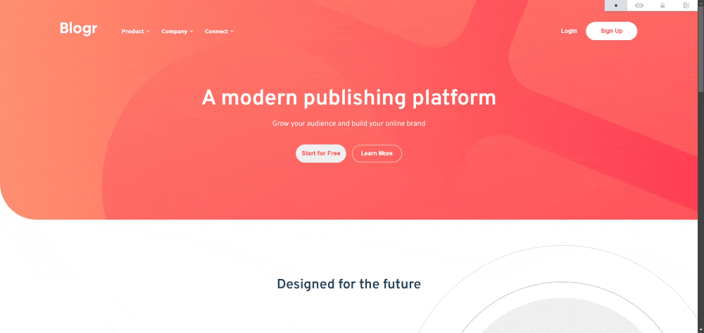

# Frontend Mentor - Blogr landing page

Esta é uma solução do desafio [Blogr landing page](https://www.frontendmentor.io/challenges/blogr-landing-page-EX2RLAApP) do Frontend Mentor, uma plataforma que ajuda a melhorar as habilidades de Desenvolvimento Web através de desafios que simulam projetos da vida real. 

## Sumário

- [Visão Geral](#visão-geral)
  - [O Desafio](#o-desafio)
  - [Screenshot](#screenshot)
  - [Links](#links)
- [Processo](#processo)
  - [Feito com](#feito-com)
  - [Aprendizados](#aprendizados)
- [Autor](#autor)

## Visão Geral

### O Desafio

Usuários devem ser capazes de:

- Ver o layout que mais de adequa de acordo com o tamanho da tela de seu dispositivo;
- Ver os elementos interativos do site ao interagir com eles.

### Screenshot

### Links

- Solução: [Add solution URL here](https://your-solution-url.com)
- Site: [Add live site URL here](https://your-live-site-url.com)

## Processo

### Feito com

- HTML
- CSS
- Javascript

### Aprendizados

Este projeto foi bom para praticar as minhas habilidades básicas de HTML, CSS e Javascript e lidar com a criação de uma landing page responsiva e funcional com responsividade, que pode ser acessada de qualquer dispositivo

## Autor

- Frontend Mentor - [@EikiDev](https://www.frontendmentor.io/profile/EikiDev)
- Linkedin - [Lucas Eiki Gushiken](https://www.linkedin.com/in/lucaseikigushiken/)